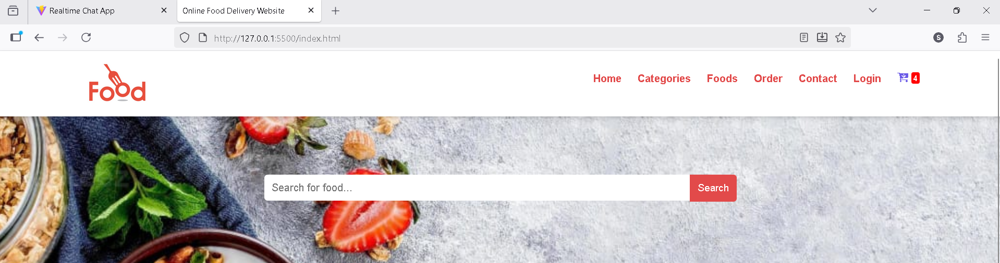
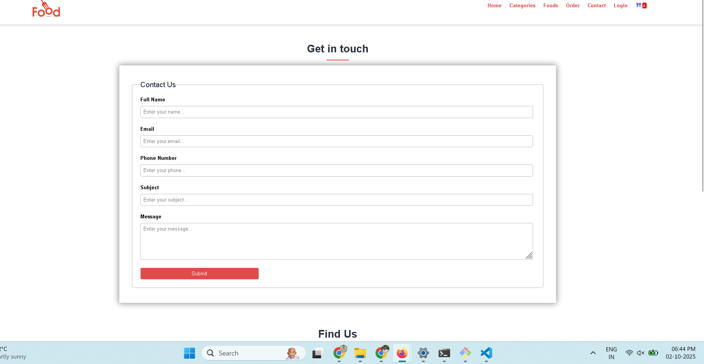
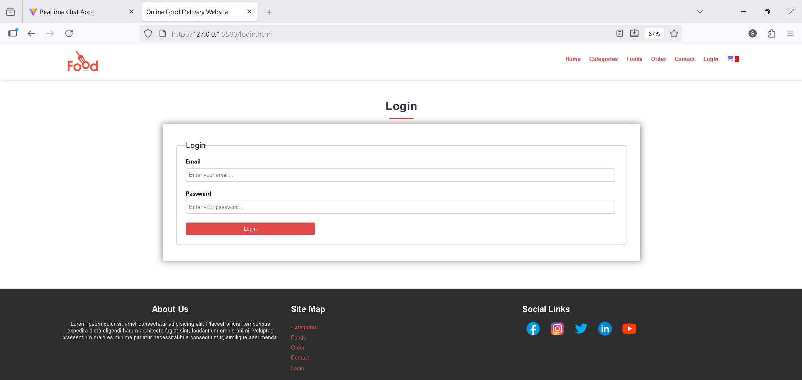

# 🍔 Food Ordering Website 🍕🍟

Welcome to my **Food Ordering Website**, built using **HTML, CSS & JavaScript**.  
Browse food items, search your favorite dishes, place orders, and track your order history!  

##  Screenshots

<details>
<summary>Home Page</summary>
<br>

</details>

<details>
<summary>Categories Page</summary>
<br>

</details>

<details>
<summary>Foods Page</summary>
<br>

</details>

<details>
<summary>Order Page</summary>
<br>

</details>

<details>
<summary>Contact Page</summary>
<br>

</details>

<details>
<summary>Login Page</summary>
<br>

</details>

---

## ✨ Features

### 🧭 Navigation Menu
- **Home** – Landing page with featured foods  
- **Categories** – Browse foods by category  
- **Foods** – List of all available food items  
- **Order** – Place your food orders  
- **Contact** – Contact form for queries  
- **Login** – Users can login to check their orders  

### 🏠 Home Page
- **Search bar** with placeholder: `Search for food...`  
- **Search button** directs to relevant categories  

### 📂 Categories Page
- Displays **random food photos**  
- Each food item has an **Order button**  

### 🛒 Order Page
- Users can select items & place orders  
- Order details captured and processed  

### 🔑 Login Page
- Users can **login**  
- View **order history** after login  

---

## 💻 Technologies Used
- HTML5  
- CSS3  
- JavaScript  
- Responsive Design  

---

## ⚡ How to Run
```bash
git clone https://github.com/sachingiri58/food_ordering_Website
open index.html in browser
